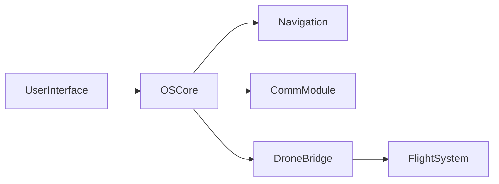

# Ursa Majora

🛰️ **Ursa Majora** is a next-generation handheld computer purpose-built for interfacing with autonomous drones in the field. Designed to be modular, durable, and deeply integrated with real-time aerial systems.

---

## 🔧 Features
- Real-time drone telemetry integration
- Secure field-grade communication protocols
- Ruggedized OS interface for field operators
- Navigation support (GNSS, IMU, barometer)
- Low-power operation with modular I/O ports

---

## 🧱 Architecture Overview



---

## 🚀 Getting Started

```bash
git clone https://github.com/savoy-research-institute/ursa-majora.git
cd ursa-majora
# Setup instructions go here
```

---

## 📄 Documentation

- [System Design Overview](docs/system-design.md)
- [Navigation Stack](docs/navigation.md)
- [Hardware Interface](docs/hardware.md)

---

## 🤝 Contributing

We welcome contributions from the community. See [CONTRIBUTING.md](CONTRIBUTING.md) for guidelines.

---

## 📜 License

MIT License © 2025 Savoy Research Institute
